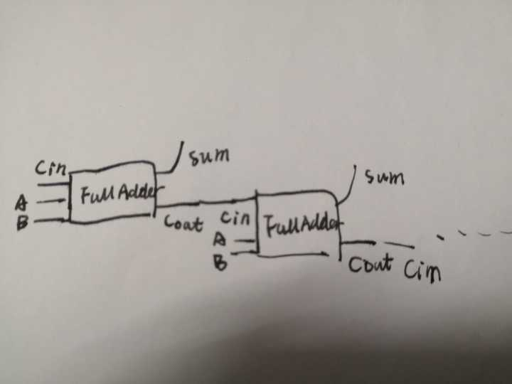

#### 1) Give the three representations of an AND gate and say in yourwords what AND means.   

|A|B|X|
|:--|:--|:--|
|0|0|0|
|1|0|0|
|0|1|0|
|1|1|1|

#### 2) Give the three representations of an XOR gate and say in yourwords what XOR means.  

|A|B|X|
|:--|:--|:--|
|0|0|0|
|1|0|1|
|0|1|1|
|1|1|1|

#### 3) Draw a circuit diagram corresponding to the following Booleanexpression: (A + B)(B + C)  

#### 4) Show the behavior of the following circuit with a truth table:  

|A|B|I|O|X|
|:--|:--|:--|:-|:-|
|0|0|1|0|1|
|1|0|0|0|0|
|0|1|1|0|1|
|1|1|0|1|1|

#### 5) What is circuit equivalence? Use truth table to prove the following formula.  

|A|B|(AB)'|A'+B'|
|:--:|:--:|:--:|:-:|
|0|0|1|1|
|1|0|1|1|
|0|1|1|1|
|1|1|0|0|

### 6  

### 7 
(X8X7X6X51111)2  
(X8X7X6X5~X4~X3~X2~X1)  
(~X8~X7~X6~X5X4X3X2X1)

# 维基百科  
### Logic gate  
a logic gate is an idealized or physical device implementing a Boolean function; that is, it performs a logical operation on one or more binary inputs and produces a single binary output.  

### Boolean algebra  
Boolean algebra is the branch of algebra in which the values of the variables are the truth values true and false, usually denoted 1 and 0 respectively.   

### Flip-flop  
触发器
SR latch stores 1 bit.