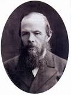
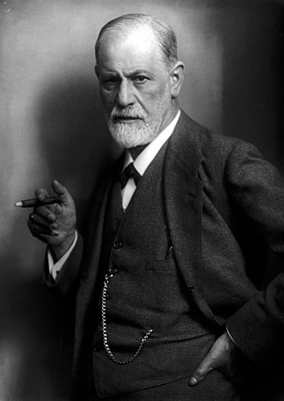

# 从陀思妥耶夫斯基，解读家庭对个人的影响

**我首次接触陀思妥耶夫斯基，是阅读他的作品《罪与罚》，讲述的是青年拉斯科列尼科夫杀人后的自我折磨与救赎，而后又阅读他的另一部名著《卡拉马佐夫兄弟》的过程则更让我震撼。**

#### 因为陀思妥耶夫斯基描绘人性最黑暗的极限

*陀思妥耶夫斯基在1821年在莫斯科出生，早年时透过童话故事及传说开始接触文学，也有涉猎俄罗斯及其他国家作者的作品。陀思妥耶夫斯基的母亲在1837年时过世，当时陀思妥耶夫斯基才15岁，同年他离开家，进入尼古拉耶夫军事工程学院就读。毕业后担任工程师，靠翻译书赚取额外的收入，短暂的享受奢华的生活。他在1846年发表了第一本小说《穷人》，让他可以进入圣彼得堡的文学圈中。1849年时因为参与的文学团体讨论一本批评沙皇，后来被禁的书而被捕，判处死判，但在最后一刻被减刑。他在西伯利亚监狱中过了四年，之后是六年的流亡义务兵役。*

*陀思妥耶夫斯基出生于莫斯科一个贫穷的家庭，在七个孩子中排名老二。他的父亲是一名退休军医和彻彻底底的酒鬼，工作于莫斯科的Mariinsky穷人医院。他的父母的家系是源自平斯克地区的立陶宛裔贵族。父亲工作的医院地处莫斯科的荒郊野岭，犯人公墓、精神病院和孤儿院便是仅有地标式建筑。这些景象给年纪尚小的陀思妥耶夫斯基留下了深刻的印象，对穷困者的怜悯深深刺痛着他的心灵。虽然父母不允许，年轻的陀思妥耶夫斯基还是喜欢去医院花园走走，看看那些晒太阳的病人，听他们讲故事。*

*坊间流传陀思妥耶夫斯基的父亲对待孩子很粗暴，比如他要求自己的孩子在他上班回来打盹时轮流替他驱赶苍蝇，而且必须保持绝对安静。然而为陀思妥耶夫斯基写传记的作家Joseph Frank却认为《卡拉马佐夫兄弟》中的父亲的原型并非作者本人的父亲。父子间的信件包括他们自己的言论都指向父子间的关系十分不错。*

*1837年他母亲死于肺结核，他和他弟弟被送入彼得堡尼克拉耶夫斯基军事工程学校。1839年在莫斯科当医生的父亲去世，死因不明。有人说是因为他醉后对农奴发脾气，农奴被激怒将他制服，灌入伏特加直至他溺死。也有人认为是自然死亡，而临近的地主为了把土地轻易拿到手而编了这个故事。或许这个专制的父亲给了陀思妥耶夫斯基很大的影响，以至于他把父亲的形象搬到了《卡拉马佐夫兄弟》中的老卡拉马佐夫这个“邪恶而感情脆弱的小丑”父亲身上。*

*陀思妥耶夫斯基患有癫痫，9岁首次发病，之后间或发作伴其一生。《卡拉马佐夫兄弟》中的斯麦尔佳科夫也是时常发作癫痫。《白痴》中，梅什金公爵也患有癫痫，不得不认为是陀思妥耶夫斯基有意为之。*

*在彼得堡的军事工程学校期间，陀思妥耶夫斯基学习他于之不屑的数学。与此同时，他还涉猎了莎士比亚、帕斯卡尔、维克多·雨果的文学作品。在数学上涉猎颇广的他考试成绩优秀，于1841接受委任。那年，他已完成了两部浪漫主义剧作，深受德国浪漫主义诗人席勒的剧作《玛丽·斯图亚特》、《鲍里斯·戈东诺夫》影响，但均失散。陀思妥耶夫斯基这个自称“做梦人”的青年人，却对席勒的这两部作品颇有取笑之意。*

*后来陀思妥耶夫斯基担任记者，有出版及编辑一些杂志，后来编辑他的作品集《A Writer's Diary》，他也开始到西欧旅游，并且有赌博成瘾的情形，这造成他经济上的困难。有一段时间他非常需要金钱，不过后来仍成为最广为人知，作品最多人阅读过的俄国作家。他的书翻译超过170种语言。陀思妥耶夫斯基受到许多哲学家及文学家的影响包括亚历山大·谢尔盖耶维奇·普希金、尼古拉·瓦西里耶维奇·果戈里、奥古斯丁、威廉·莎士比亚、查尔斯·狄更斯、奥诺雷·德·巴尔扎克、米哈伊尔·莱蒙托夫、维克多·雨果、爱伦·坡、柏拉图、米格尔·德·塞万提斯、亚历山大·伊万诺维奇·赫尔岑、伊曼努尔·康德、维萨里昂·格里戈里耶维奇·别林斯基、黑格尔、弗里德里希·席勒、弗拉基米尔·索洛维约夫、米哈伊尔·亚历山德罗维奇·巴枯宁、乔治·桑、E·T·A·霍夫曼及亚当·密茨凯维奇。他的作品也影响了许多的文学家（例如亚历山大·伊萨耶维奇·索尔仁尼琴及安东·帕夫洛维奇·契诃夫）及哲学家（例如弗里德里希·尼采及让-保罗·萨特）。*  
*(摘自维基百科)*

**从陀思妥耶夫斯基的经历之中，我们可以了解到他的人生坎坷。他不幸的人生经历影响了他的作品，从而使他的作品如此尖锐而黑暗。他的父亲非常之残暴，从他的作品《卡拉马佐夫兄弟》中，我们完全可以看出在陀氏心中父亲的给他印象如何。**

#### 陀思妥耶夫斯基与弑父情结

*在陀思妥耶夫夫斯基丰富的人格中，可分出四个方面：富有创造性的艺术冢、神经症者、道德家和罪人。对于这样一种令人迷惑的复杂人格应如何去认识？*  
*有创造性的艺术家这一点是最无争议：陀思妥耶夫斯基的地位并不低于莎士比亚。《卡拉马佐夫兄弟》是迄今为止最优秀的小说，其中关于宗教法庭庭长的那段描写，达到了世界文学的巅峰，再溢美的评价似乎也不过分。所以，在创造性艺术家这一点上，精神分析就显得不必要了。*  
*陀思妥耶夫斯基的道德家(moralist)这一特征，最易受到攻击。如果我们借口惟有经历了深重的罪恶的人才能达到道德的顶峰，而试图将他放在道德家的高度的话，那么我们就忽视了由此将引起的一个疑惑：有道德的是指，一个人一旦他感受到诱惑便能予以抵制，而不屈服于诱惑。如果一个人先是犯罪，然后又悔过，悔过后树立起高尚的道德标准，这样他便会受到外界的责难，因为他把事情变得太容易了，他尚未掌握道德的实质：自我克制（enunciation）。实际上，生活中的道德行为是人的一种实践性的功利活动。他使人想起大迁徙中的野蛮人，他们杀人而又以苦行来赎罪，直到苦行成为使杀戮能够进行的实用手段。可怕的伊凡就是这样做的。看来，这种对道德的妥协的确是俄罗斯人的典型特征。陀思妥耶夫斯基道德追求的努力，最终没有产生卜分光彩的结果。在经历了个人本能要求与社会呼吁之间相妥协的最激烈斗争之后，他倒退到既甩服俗权又臣服神权，既崇拜沙皇又崇拜基督教上帝以及狭隘的俄罗斯民族主义(nationalism)--这种倒退是一个人不费力不用脑子就能够达到的。这是他伟大人格中的弱点。陀思妥耶夫斯基放弃了成为人类的导师和救星的机会，而成了人类的监狱看守的同伙。人类文明的未来对他没有什么可感激的。而他似乎是因为神经症招致这种失败的。他的睿智和他对人类的强烈的爱或许能为他打开另外一条使徒式的生活道路。*  
———弗洛伊德