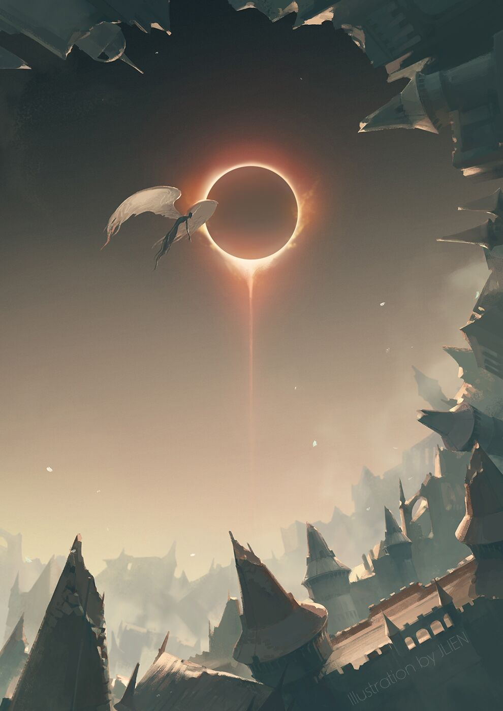
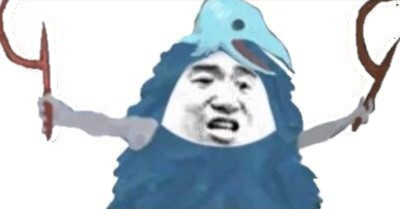
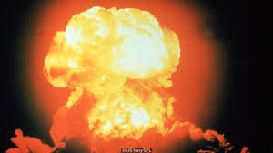
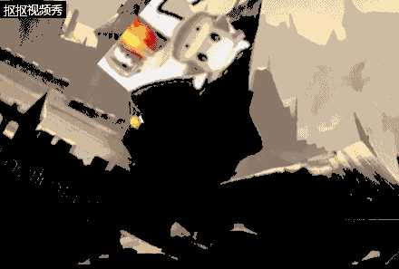

# 用construct2制作一款射击游戏
用construct2制作一款射击游戏并不是一件容易的事情，也许你会需要一些特定的操作去完成这项工作，现在，我想请你跟我一起来看看我制作这款游戏的流程，

### 制作你的背景
制作背景是我们制作这款游戏的第一步，在界面中单击右键，然后选择insert new objeck，再选择array，然后指定一张你的图片吧。  
我使用的是这张。    
   

完成后锁定你的背景以防误操作。

### 加入人物  
- 首先需要加入的当然是我们的主角  
右键点击背景，选择insert new objeck, 然后选择sprite，再指定一张图片。  
我使用的是这张  

给我们的主角添加几个特性
1. 8Direction：让我们的主角8向移动  
2. ScrollTo：让镜头跟紧主角
3. BoundTOLayout；让主角不移出区域外

### 加入怪物和其它生物  

我加入的怪物是这个  

给怪物加入特性bullet，让怪物可以移动
我还加入了另一种怪物  

   
 
它们会在场上移动，并试图与玩家碰撞，以伤害玩家。

### 使主角射出子弹

首先我们需要先添加子弹精灵，使用一张子弹图片，这里不将图片列出。  
添加事件，对我们的主角，点击鼠标右键以创造另外一个物体，即是我们的子弹。  
在event中加入一些其它元素，使子弹能与敌人碰撞。

### 添加一些其它细节  

比如人物血量和怪物血量、怪物移动方式、子弹爆炸效果，这些都在event里添加.
为了不使我们的怪物在接触子弹时立即死亡，我们需要给怪物设置血量。
或者我们可以让子弹产生爆炸效果，这样可以使游戏更加的炫酷。

 
在我们的人物受伤后，将会有以下图片出现

### 完成了

看一看效果吧 

