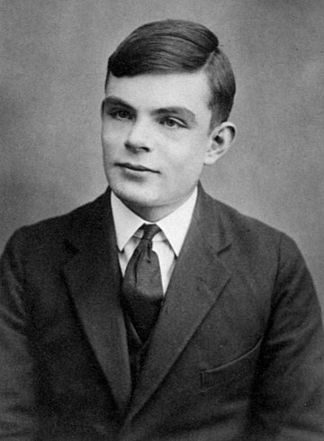

# 艾伦·图灵的年轻时代

**不用多说，学计算机的你一定听说过计算机与人工智能之父：艾伦·图灵，可是你对他年轻时了解吗？今天，就请大家来跟我一起来了解一下艾伦·图灵年轻时吧。**

**以下部分材料来自维基百科**

  

艾伦·麦席森·图灵，OBE，FRS（英语：Alan Mathison Turing，又译阿兰·图灵，Turing也常翻译成涂林或者杜林，1912年6月23日－1954年6月7日）是英国计算机科学家、数学家、逻辑学家、密码分析学家和理论生物学家，他被视为计算机科学与人工智能之父。

在第二次世界大战期间，图灵曾在“政府密码学校”工作。政府密码学校位于布莱切利园，是英国顶级机密情报机构。图灵在这里从事密码破译工作，有一段时间，他领导了小屋8号（Hut 8）小组，负责德国海军密码分析。 期间他设计了一些加速破译德国密码的技术，包括改进波兰战前研制的机器Bombe，一种可以找到恩尼格玛密码机设置的机电机器。 图灵在破译截获的编码信息方面发挥了关键作用，使盟军能够在包括大西洋战役在内的许多重要交战中击败纳粹，并因此帮助赢得了战争。

图灵对于人工智能的发展有诸多贡献，例如图灵曾写过一篇名为《Computing Machinery and Intelligence》的论文，提问“机器会思考吗？”（Can Machines Think?），作为一种用于判定机器是否具有智能的测试方法，即图灵测试。至今，每年都有试验的比赛。此外，图灵提出的著名的图灵机模型为现代计算机的逻辑工作方式奠定了基础。

#### 儿时的图灵

图灵的父亲朱利斯·麦席森·图灵（Julius Mathison Turing）是一名英属印度的公务员。1911年，图灵的母亲Ethel在印度的Chatrapur怀了孕。因为他们希望艾伦在英国出生，所以回到伦敦，住在帕丁顿，并在那里生下了艾伦。父亲的公务员委任使他在艾伦小时候经常来往于英伦和印度。由于担心印度的气候不利于儿童成长，他便把家庭留在英伦与朋友同住。图灵很小的时候就表现出他的天才，后来就更加显著。他说他在三个星期里自己学会阅读，而且，就对数字和智力游戏着迷。

六岁的时候，他的父母为他在一间叫圣迈克尔的（St. Michael's）日间学校注了册。女校长很快就注意到他的才能，随后Marlborough学院的许多教育家也注意到这点。1926年，他十四岁的时候转到了在多塞特郡的Sherborne寄宿学校。开学的第一天，刚好遇上了大罢工。图灵决心要赶上第一天的课，于是他独自从南安普顿骑了六十英里的自行车去上学，途中还在一间旅社度过一宵。

图灵天生对科学的喜好并没有给他在Sherborne的老师留下好印象。他们对教育的定义是着重于人文学科而不是科学。虽然如此，图灵继续在他喜欢的学科表现出惊人的能力，还没有学过基础微积分的他，就已经能够解答以他年纪来说算是很高深的难题。

1928年，在图灵16岁的时候，开始阅读阿尔伯特·爱因斯坦的著作。他不但能够理解，而且看出了爱因斯坦对牛顿运动定律存有质疑，即使爱因斯坦的著作中并没有明白指出这点。

#### 大学和可计算性的工作

剑桥大学国王学院的电脑房现在以图灵为名
1931年，图灵考入剑桥大学国王学院。1934年他以优异成绩毕业。1935年因为一篇有关中心极限定理的论文当选为国王学院院士。

图灵在他的重要论文《论可计算数及其在判定问题上的应用》（英语：On Computable Numbers, with an Application to the Entscheidungsproblem(Orignal Paper)，1936年5月28日提交）里，对哥德尔1931年在证明和计算的限制的结果作了重新论述，他用现在叫做图灵机的简单形式的抽象装置代替了哥德尔的以通用算术为基础的形式语言。虽然图灵机过于缓慢的速度使其没有实际用途，图灵还是证明了这样的机器有能力解决任何可想像的，并以数学式表达的数学难题。现今，图灵机还是计算理论研究的中心课题。他继续证明了判定问题是没有答案的。他的证明首先展示了图灵机的停机问题是没有答案的，这是说不可能用一个算法来决定一台指定的图灵机是否会停机。尽管他的证明比阿隆佐·邱奇在λ演算方面相等的证明晚发表了几个月，图灵的著作是更易于理解和直观的。他的通用（图灵）机的概念也是新颖的。这一通用机能够完成任何其他机器所能做的任务。这篇论文还介绍了可定义数的概念。

图灵在普林斯顿大学度过了1937年和1938年的大部分时间，在邱奇指导下学习。1938年，他取得了博士学位。他的论文介绍了超计算的概念，在图灵机加上了预言机，让研究图灵机无法解的问题变得可能。

1939年图灵回到剑桥，聆听了维特根斯坦关于数学基本原理（Foundations of mathematics）的讲座。他们激烈地争论，图灵为形式主义辩护，而维特根斯坦则认为把数学抬得太高而且不能发现任何绝对真理。