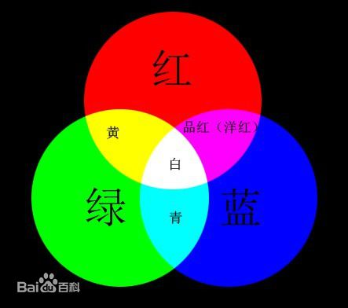

# RGB色彩表示  

我们都知道，每种颜色都由红绿蓝三原色组成，即RGB。在计算机中，RGB的每个通道，通常都以8位2进制空间来存储，因此能对每个通道进行256阶分级： 
以10进制数表示时，范围为0~255； 
以16进制数表示时，范围为0~FF。  
而我们通过一个以“#”开头的6位十六进制数值表示一种颜色。6位数字分为3组，每组两位，依次表示红、绿、蓝三种颜色的强度。 

如下图  

在我们的RGB 颜色模式，颜色由表明红色，绿色，和蓝色各成分强度的三个数值表示。从最小值0到最大值255，当所有RGB都在最低值被显示的颜色将是黑色，当RGB都为最大值被显示的颜色将是白色。 
每种原色的数字范围从0 到255。这类型数字代表由计算机程序设计者广泛实施存放各颜色价值在一个8位字节。就比如最强的红色表示为255,0,0。  

## 原理  

RGB是从颜色发光的原理来设计定的，通俗点说它的颜色混合方式就好像有红、绿、蓝三盏灯，当它们的光相互叠合的时候，色彩相混，而亮度却等于两者亮度之总和,越混合亮度越高，即加法混合。  
有色光可被无色光冲淡并变亮。如蓝色光与白光相遇，结果是产生更加明亮的浅蓝色光。知道它的混合原理后，在软件中设定颜色就容易理解了。
红、绿、蓝三盏灯的叠加情况，中心三色最亮的叠加区为白色，加法混合的特点：越叠加越明亮。

