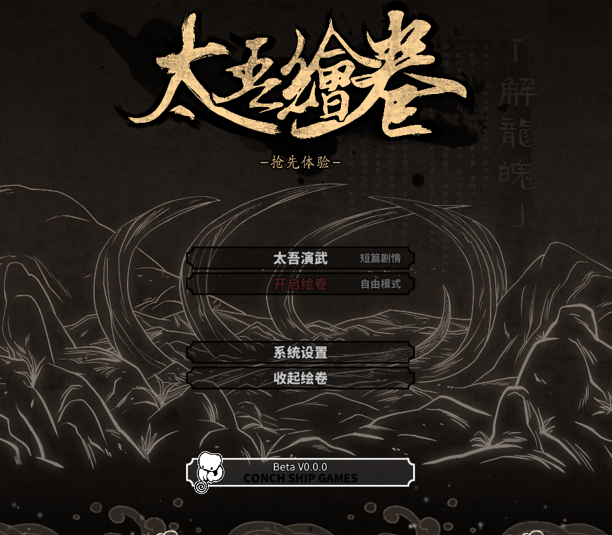
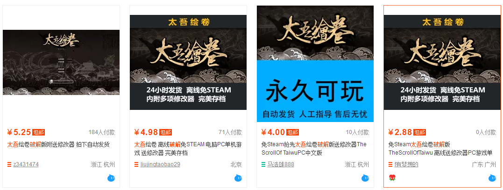

## IT伦理道德 —— 反对盗版游戏 

在很多国人的认识中，游戏都是不需要花钱购买的.   
可以说这是完全错误的.   
一款3a大作往往开发资金亿美金起，上千人的团队开发，无数的工程师，剧情设计者，长达数年的开发时间，吹毛求疵，这样的作品，不可能免费。  

而一部新兴国产武侠作品——太吾绘卷的故事则更加令人感叹盗版游戏对游戏原开发者的伤害
这款游戏的制作人茄子顶着没有收入、未来不明的巨大压力，和另外两名小伙伴坚持开发了三年《太吾绘卷》。  

游戏在9月21日上架Steam，一经推出就广受玩家好评，热度大涨。不过，热度大涨的另一面，是游戏在发售的当天就惨遭破解，去淘宝搜索，你最低只需要3块不到，就可以玩到与正版内容相差无几的盗版。  

由于团队体量太小，《太吾绘卷》官方对市面上的盗版毫无办法，只有弱弱的在群里发声，希望玩家们可以共同抵制。

可以说，《太吾绘卷》现在的遭遇也是很多国产独立制作人的遭遇，小成本的工作室光是制作游戏就已经竭尽全力，更遑论再去防盗版。

所以游戏一经破解，制作人的心血就往往要流失大半。而对游戏制作人而言如此残酷的盗版，在中国却早就已经如空气一般，成为人们习以为常的存在。

希望盗版游戏可以不要那么猖獗，这才是对国产游戏市场最好的保护。